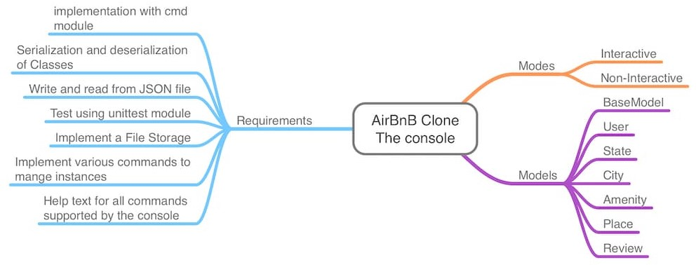
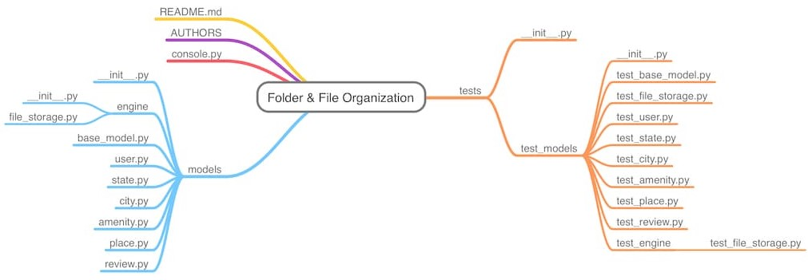
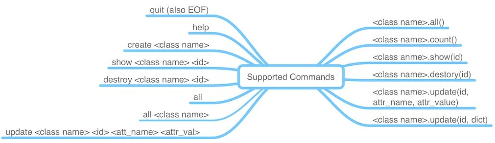
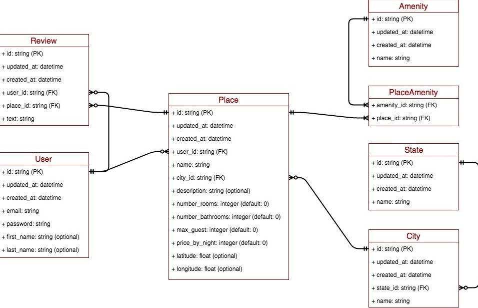

# AirBnB clone - The console


## Project Overview
AirBnB Clone (the console) project is a stack of the AirBnB web application. This repo contains a console application that can be used to manage the various instances of class used in the AirBnB web application. It is a team project to build a clone of [AirBnB](https://www.airbnb.com/) at (Alx) Holberton School Software Engineering program. </br> 

It represents the first step towards building a full web application. **AirBnB** is a *complete web application*, integrating database storage, a back-end API, and front-end interface in a clone of AirBnB.

This is part 1 of our AirBnb Clone project. The purpose of this project is to make a command interpreter that manages our AirBnb objects.

This first step consists of:
- a custom command-line interface for data management,
- and the base classes for the storage of this data.



## Project File Organization
This project is organized as shown in the diagram below. In this hierarchal structure, all the models are stored in the models folder while the tests are stored in the tests folder



## Supported Commands
This console application supports a number of commands. This commands can be run in both interactive and non-interactive modes.




## Usage 💻

The console works both in interactive mode and non-interactive mode, much like a Unix shell.
It prints a prompt **(hbnb)** and waits for the user for input.
The console is a command interpreter to manage objects abstraction between objects and how they are stored.


Command | Example
------- | -------
Run the console | ```./console.py```
Quit the console | ```(hbnb) quit```
Display the help for a command | ```(hbnb) help <command>```
Create an object (prints its id)| ```(hbnb) create <class>```
Show an object | ```(hbnb) show <class> <id>``` or ```(hbnb) <class>.show(<id>)```
Destroy an object | ```(hbnb) destroy <class> <id>``` or ```(hbnb) <class>.destroy(<id>)```
Show all objects, or all instances of a class | ```(hbnb) all``` or ```(hbnb) all <class>```
Update an attribute of an object | ```(hbnb) update <class> <id> <attribute name> "<attribute value>"``` or ```(hbnb) <class>.update(<id>, <attribute name>, "<attribute value>")

## 0x01 Introduction

The console will perform the following tasks:

* Create a new object
* Retrieve an object from a file
* Do operations on objects
* Destroy an object


## CONCEPTS LEARNT

-    How to create a Python package
-    How to create a command interpreter in Python using the `cmd` module
-    What is Unit testing and how to implement it in a large project
-    How to serialize and deserialize a Class
-    How to write and read a JSON file
-    How to manage `datetime`
-    What is an `UUID`
-    What is `*args` and how to use it
-    What is `**kwargs` and how to use it
-    How to handle named arguments in a function


### Storage

All the classes are handled by the `Storage` engine in the `FileStorage` Class.

## 0x02 Environment

<!-- ubuntu -->
<a href="https://ubuntu.com/" target="_blank"> </a> <!-- bash --> <a href="https://www.gnu.org/software/bash/" target="_blank"> </a> <!-- python--> <a href="https://www.python.org" target="_blank"> </a> </a> <!-- vim --> <a href="https://www.vim.org/" target="_blank"> </a> <!-- vs code --> <a href="https://code.visualstudio.com/" target="_blank"> </a> </a><!-- git --> <a href="https://git-scm.com/" target="_blank"> </a> <!-- github --> <a href="https://github.com" target="_blank"> </a>
 <!-- Style guidelines -->
* Style guidelines:
  * [pycodestyle (version 2.7.*)](https://pypi.org/project/pycodestyle/)
  * [PEP8](https://pep8.org/)

All the development and testing was run over an operating system Ubuntu 20.04 LTS using programming language Python 3.8.3. The editors used were VIM 8.1.2269, VSCode 1.6.1 .Control version using Git 2.25.1.

## 0x03 Installation

change to the `AirBnb` directory and run the command:

```bash
 ./console.py
```

### Execution

In interactive mode

```bash
$ ./console.py
(hbnb) help

Documented commands (type help <topic>):
========================================
EOF  help  quit

(hbnb)
(hbnb)
(hbnb) quit
$
```

in Non-interactive mode

```bash
$ echo "help" | ./console.py
(hbnb)

Documented commands (type help <topic>):
========================================
EOF  help  quit
(hbnb)
$
$ cat test_help
help
$
$ cat test_help | ./console.py
(hbnb)

Documented commands (type help <topic>):
========================================
EOF  help  quit
(hbnb)
$
```

## 0x04 Testing

All the test are defined in the `tests` folder.

### Documentation

* Modules:

```python
python3 -c 'print(__import__("my_module").__doc__)'
```

* Classes:

```python
python3 -c 'print(__import__("my_module").MyClass.__doc__)'
```

* Functions (inside and outside a class):

```python
python3 -c 'print(__import__("my_module").my_function.__doc__)'
```

and

```python
python3 -c 'print(__import__("my_module").MyClass.my_function.__doc__)'
```

### Python Unit Tests

* unittest module
* File extension ``` .py ```
* Files and folders star with ```test_```
* Organization:for ```models/base.py```, unit tests in: ```tests/test_models/test_base.py```
* Execution command: ```python3 -m unittest discover tests```
* or: ```python3 -m unittest tests/test_models/test_base.py```

### run test in interactive mode

```bash
echo "python3 -m unittest discover tests" | bash
```

### run test in non-interactive mode

To run the tests in non-interactive mode, and discover all the test, you can use the command:

```bash
python3 -m unittest discover tests
```


## 0x05 Usage

* Start the console in interactive mode:

```bash
$ ./console.py
(hbnb)
```

* Use help to see the available commands:

```bash
(hbnb) help

Documented commands (type help <topic>):
========================================
EOF  all  count  create  destroy  help  quit  show  update

(hbnb)
```

* Quit the console:

```bash
(hbnb) quit
$
```

### Commands

> The commands are displayed in the following format *Command / usage / example with output*

* Create

> *Creates a new instance of a given class. The class' ID is printed and the instance is saved to the file file.json.*

```bash
create <class>

```

```bash
(hbnb) create BaseModel
6cfb47c4-a434-4da7-ac03-2122624c3762
(hbnb)
```

* Show

```bash
show <class> <id>
```

```bash
(hbnb) show BaseModel 6cfb47c4-a434-4da7-ac03-2122624c3762
[BaseModel] (a) [BaseModel] (6cfb47c4-a434-4da7-ac03-2122624c3762) {'id': '6cfb47c4-a434-4da7-ac03-2122624c3762', 'created_at': datetime.datetime(2021, 11, 14, 3, 28, 45, 571360), 'updated_at': datetime.datetime(2021, 11, 14, 3, 28, 45, 571389)}
(hbnb)
```

* Destroy

> *Deletes an instance of a given class with a given ID.*
> *Update the file.json*

```bash
(hbnb) create User
0c98d2b8-7ffa-42b7-8009-d9d54b69a472
(hbnb) destroy User 0c98d2b8-7ffa-42b7-8009-d9d54b69a472
(hbnb) show User 0c98d2b8-7ffa-42b7-8009-d9d54b69a472
** no instance found **
(hbnb)
```

* all

> *Prints all string representation of all instances of a given class.*
> *If no class is passed, all classes are printed.*

```bash
(hbnb) create BaseModel
e45ddda9-eb80-4858-99a9-226d4f08a629
(hbnb) all BaseModel
["[BaseModel] (4c8f7ebc-257f-4ed1-b26b-e7aace459897) [BaseModel] (4c8f7ebc-257f-4ed1-b26b-e7aace459897) {'id': '4c8f7ebc-257f-4ed1-b26b-e7aace459897', 'created_at': datetime.datetime(2021, 11, 13, 22, 19, 19, 447155), 'updated_at': datetime.datetime(2021, 11, 13, 22, 19, 19, 447257), 'name': 'My First Model', 'my_number': 89}"]
["[BaseMode
```

* count

> *Prints the number of instances of a given class.*

```bash
(hbnb) create City
4e01c33e-2564-42c2-b61c-17e512898bad
(hbnb) create City
e952b772-80a5-41e9-b728-6bc4dc5c21b4
(hbnb) count City
2
(hbnb)
```

* update

> *Updates an instance based on the class name, id, and kwargs passed.*
> *Update the file.json*

```bash
(hbnb) create User
1afa163d-486e-467a-8d38-3040afeaa1a1
(hbnb) update User 1afa163d-486e-467a-8d38-3040afeaa1a1 email "aysuarex@gmail.com"
(hbnb) show User 1afa163d-486e-467a-8d38-3040afeaa1a1
[User] (s) [User] (1afa163d-486e-467a-8d38-3040afeaa1a1) {'id': '1afa163d-486e-467a-8d38-3040afeaa1a1', 'created_at': datetime.datetime(2021, 11, 14, 23, 42, 10, 502157), 'updated_at': datetime.datetime(2021, 11, 14, 23, 42, 10, 502186), 'email': 'aysuarex@gmail.com'}
(hbnb)

```
### OBJECTS IMPLEMENTED
This repository contains the following files:

| Folder | File | Description |
| :--- | :--- | :--- |
| tests |  | Contains test files for AirBnb Clone |
|  | console.py | Command line Interpreter for managing AirBnB objects |
| models | base_model.py | Defines all common attributes/methods for other classes |
| models | amenity.py | Creates class `amenity` |
| models | city.py | Creates class `city` |
| models | place.py | Creates class `place` |
| models | review.py | Creates class `review` |
| models | state.py | Creates class `state` |
| models | user.py | Creates class `user` |
| models/engine/ | file_storage.py | Serializes instances to a JSON file and deserializes JSON file to instances |


-
## Authors
<details>
    <summary>Ololade Akinloye</summary>
    <ul>
    <li><a href="https://www.github.com/Computewell">Github</a></li>
    <li><a href="https://www.twitter.com/Loladecodes">Twitter</a></li>
    </ul>
</details>
<details>
    <summary>Baruch Favour</summary>
    <ul>
    <li><a href="https://www.github.com/chigo1">Github</a></li>
    <li><a href="https://www.twitter.com/favourbaruch">Twitter</a></li>
    </ul>
</details>